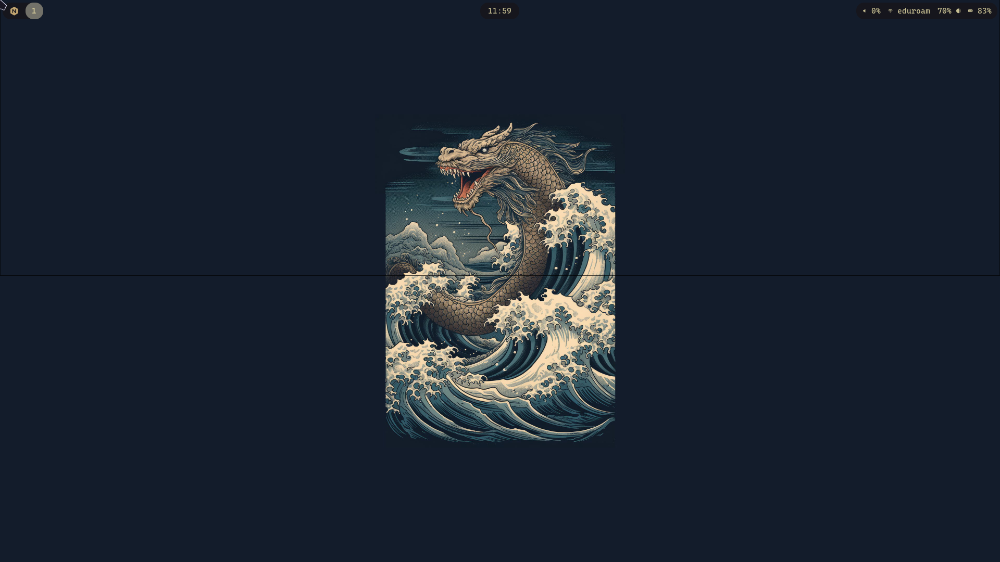
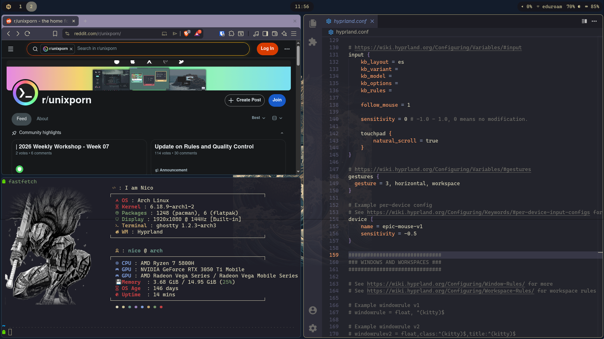
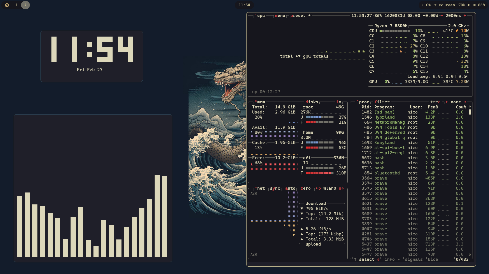
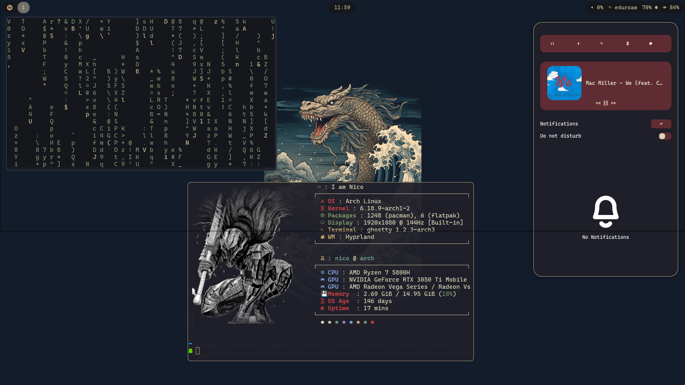

# 🏯 Kanagawa Dotfiles | Arch Linux + Hyprland

<div align="center">
  
  
  <p align="center">
    
    
    
    
    
    
  </p>

  **Configuración minimalista, productiva y centrada en el esquema de colores Kanagawa.**
</div>

---

## 🎨 Galería
Aquí puedes ver cómo luce el sistema con diferentes aplicaciones abiertas:

<div align="center">
  <table>
    <tr>
      <td><br align="center">Codium + Brave</td>
      <td><br align="center">Escritorio limpio</td>
    </tr>
    <tr>
      <td><br align="center">TUI Apps</td>
      <td><br align="center">Swaync Details</td>
    </tr>
  </table>
</div>

---

## 🛠️ Stack Tecnológico

| Componente | Herramienta |
| :--- | :--- |
| **OS** | [Arch Linux](https://archlinux.org/) |
| **WM** | [Hyprland](https://hyprland.org/) (Wayland) |
| **Terminal** | [Ghostty](https://ghostty.org/) |
| **Barra** | [Waybar](https://github.com/Alexays/Waybar) |
| **Lanzador** | [Wofi](https://hg.sr.ht/~scoopta/wofi) |
| **Editor** | [Neovim](https://github.com/neovim/neovim) (Lua config) / [VSCodium](https://vscodium.com/) |
| **Shell** | Zsh + Oh My Zsh + Powerlevel10k |
| **Utilidades** | Bat, Eza, Zoxide, Fzf, Atuin |

---

## 📂 Estructura del Repositorio
El repositorio está organizado para ser gestionado fácilmente con **GNU Stow**:

* `config/`: Contiene las configuraciones para Hyprland, Waybar, Ghostty y Wofi.
* `scripts/`: Scripts personalizados para automatización y ricing.
* `shell/`: Configuración de Zsh, alias y plugins.
* `screenshots/`: Capturas de pantalla del sistema.

---

## 🚀 Instalación

> [!CAUTION]
> Antes de ejecutar el instalador, asegúrate de hacer un respaldo de tus configuraciones actuales.

### 1. Clonar el repositorio
```bash
git clone [https://github.com/nixer112/dotfiles.git](https://github.com/nixer112/dotfiles.git) ~/dotfiles
cd ~/dotfiles
